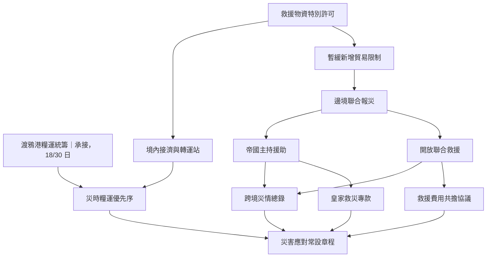

# 樣稿：從北境施壓到共同救災

日期：2026-09-29。供使用者閱讀與評估的分期內容樣品，非 API 實際輸出、非可匯入國策檔，分期程式尚未實作。

沿用《樣稿-奧古斯提姆帝國兩期.md》的帝國、維奧萊塔、渡鴉港與諾斯加德聯盟等名稱。本篇的外交爭議、災害、國策與事件均為假設劇情，不代表世界書既有事實，也不接續舊樣稿的戰爭結果。規則依《設計方向討論.md》的「分期規格補充」。

本樣品採標準規模：第一期 12 項，第二期 12 項（1 項承接、11 項新增）。第二期將承接項算入畫面總數只是樣品的計數方式，正式規模是否包含承接項仍需決定。兩棵樹同時寫在此文件是方便比較；實際運作只保留當前樹與往期摘要。

## 進入第一期時

### 第一期：北境的帳，帝國的糧

北境商路上的信用爭議延燒到渡鴉港。部分帝國商人要求朝廷追討損失，另一批商人則警告，全面封鎖將先切斷帝國自己的糧運。維奧萊塔決定重新整理北境貿易秩序，但尚未決定要以禁運還是交涉收場。

**本期目的**：處理北境信用爭議，建立可持續的貿易與糧運安排。

**延續的長期方向**：維持帝國主導權，並讓民生與軍需不因單一外部商路中斷而失序。它們在換期後仍然有效，不必每期重新立項。

下表中的編號只供本樣品對照。「完成」指取得所列政策成果；各方反應與後續執行由事件繼續推進。

| 編號 | 國策 | 內容與直接成果 | 前置與選擇 |
|---|---|---|---|
| A01 | 北境商路總核查 | 彙整欠款、貨源與航運依賴，讓朝廷知道施壓會傷到誰。完成時取得可供決策的核查報告。 | 起點 |
| A02 | 凍結新增官方信用 | 暫停為新一批北境交易提供皇家擔保，保留已簽契約的處理窗口。 | A01 |
| A03 | 民生日用豁免表 | 將基本糧食、藥材列入貿易限制的豁免範圍，公布受理辦法。 | A02 |
| A04 | 渡鴉港糧運統籌 | 整合港口糧倉、船期與內陸轉運責任，形成可執行的調度規程。實際運糧由事件追蹤。 | A03 |
| A05 | 舊債另案清理 | 建立既有債務的申報、核驗與交涉程序，不把全部舊債直接當成拒付。 | A02 |
| A06 | 定向禁運清單 | 限制特定貨物與交易對象，向北境施壓；完成清單不代表對方已讓步。 | A05；與 A07 互斥 |
| A07 | 限期交涉訓令 | 授權使節提出期限與底線，保留達成清算協議的可能。 | A05；與 A06 互斥 |
| A08 | 西境軍需優先 | 將緊缺船位優先留給軍需；提高軍方調度能力，也讓民用承運商承受壓力。 | A04；與 A09 互斥 |
| A09 | 平民糧運保留額 | 為城市糧食保留最低運量，軍方接受其餘船位再行調度的限制。 | A04；與 A08 互斥 |
| A10 | 過境聯查規程 | 為禁運建立跨關口查驗與申訴程序，避免各地自行加碼。 | A06 |
| A11 | 有條件恢復清算 | 在對方接受且實際履行商定條款後恢復部分信用清算。 | A07；需要交涉取得實際成果 |
| A12 | 北境貿易新秩序 | 依所選路線確立常態貿易規則與糧運安排，結束本輪臨時措施。 | A10 或 A11，並完成 A08 或 A09 |

### 點開「渡鴉港糧運統籌」

> **渡鴉港糧運統籌**
>
> 渡鴉港從不缺少帳簿，缺的是願意對同一批糧食負責的人。港務官說船期由商人決定，商人說糧倉只聽領主命令，領主則把延誤歸咎於軍方徵用。朝廷將把船位、倉儲與轉運納入同一份調度規程。往後每一道徵用命令，都必須說明代價由誰承擔。
>
> **完成成果**：糧運統籌規程生效，指定跨部門調度責任；不代表所有糧食已經送達。
>
> **當前進度**：18／30 故事日。港口與糧倉名冊已核定，內陸轉運配額仍在協調。
>
> **相關事件**：〈渡鴉港的船位之爭〉持續更新。

此時 A01、A02、A03 已完成，A04 是唯一正在執行的國策，其餘尚未開始。國家沒有同時推進第二項主國策；商人運糧與官員執行既定措施，仍可在事件中繼續。

## 世界先改變了

在上述進度時，一場跨越國境的災害打斷原本的安排。本例假設北境多處地脈失穩，造成道路塌陷、聚落撤離與糧食缺口；這是此次樣品的外部劇情輸入，不是完成某項國策才獲得的事件。

### 本次世界消息

> **北境道路斷裂，第一批避難者抵達邊境**
>
> 原本駐留渡鴉港催討欠款的聯盟商館，今晨轉而遞交了糧食與藥材需求。帝國境內也傳來相似的地脈異動，朝廷已無法把災害視為鄰國內政。兩國官員開始交換災情，聯合救援的形式尚未談妥。

### 同一件舊事件，出現新進展

**〈渡鴉港的船位之爭〉，仍在進行。**

- 先前：軍需官與糧商爭奪船位，港務署正在核定內陸轉運配額。
- 現在：北境急需救援糧，帝國城市也擔心缺糧；原有船位爭議擴大為軍需、民生與救援的分配問題。已離港的糧船照原目的地航行，新申請尚未核准。
- 後續：待國家確立救援與分配政策，事件再更新各方反應及實際運送情況。不能在尚未開放救援前，直接寫成大批救援船已出航。

### 此時直接換期

本期以信用施壓重整貿易秩序的主要前提已經改變。繼續把國家注意力放在如何迫使北境讓步，無法應付跨境災害與國內缺糧風險；新議程必須回答如何救災、如何合作，以及誰承擔成本。

A04 的糧運統籌仍有意義，因此保留為下一期起點；其他尚未執行的國策離開當前樹，不逐項建立封存紀錄。這不是因為完成了某個比例：此時只完成 3 項，仍然可以換期。

使用者看到新一期出現，不會先收到要求批准的換期提案。以下判斷說明是樣品的閱讀輔助，不是新增的歷史資料欄位。

## 換期後，往期實際只留下這些

**時間**：復興紀元 490 年 10 月至 491 年 1 月（樣品採月份展示；正式故事時間沿用既有時間資料）。

**摘要**：

> 帝國核查北境商路並凍結新增官方信用，同時保留糧食與藥材豁免，著手統籌渡鴉港糧運。禁運與交涉路線尚未選定，跨境地脈災害便迫使朝廷轉向救援與民生供應。糧運統籌仍在進行；信用凍結尚未解除，對外救援也尚未獲得正式授權。

這就是本期的整筆歷史內容：時間與一段摘要。沒有另外附上國策清單、完成數、封存原因或未解問題表。摘要長度僅為樣例，不設定正式字數上限。

目前有效的信用凍結、民生豁免、A04 的 18／30 日進度與〈船位之爭〉事件，仍在當前狀態中。它們不靠摘要重新生成，也不因為換期自動解除。

## 第二期：災厄越過國境

邊境沒有擋住地脈的裂隙，也擋不住缺糧的人。帝國可以決定援助的條件，卻已無法選擇是否受到災害影響。維奧萊塔面前的問題變成：讓鄰國走進共同救援的安排，還是由帝國掌握援助的組織與分配。

**本期目的**：建立跨境災害應對與糧食分配安排，避免救援擠垮帝國自身的供應。

**長期方向**：維持帝國主導權與供應韌性的原方向繼續有效；共同救災本身不代表放棄主導權，也不代表兩國舊爭議已經解決。

### 國策樹的承接



圖中「開放聯合救援」與「帝國主持援助」互斥；它們通往總錄的前置是二擇一。終點需要糧運優先序、災情總錄，以及所選路線的經費安排全部完成。連線表示實際前置，不只是排版。

本例試用尚待定案的建議：A04 放在新樹上方作為承接點，救援許可仍可獨立開始，不必等待糧運統籌完成。每次仍只能選一項主國策；允許選擇其他議程不代表並行推進全部節點。

| 編號 | 國策 | 內容與直接成果 | 前置與選擇 |
|---|---|---|---|
| A04 | 渡鴉港糧運統籌 | 原國策原樣承接，仍為 18／30 日；完成後可支援災時配額。 | 延續中，無須重做前期國策 |
| B02 | 救援物資特別許可 | 在現有民生豁免之外，開設跨境救援申請窗口、查驗辦法與承運責任。 | 新期可選起點 |
| B03 | 暫緩新增貿易限制 | 暫停擴大施壓措施；對救援交易提供有限例外，其他信用凍結仍有效。 | B02 |
| B04 | 邊境聯合報災 | 與對方建立災情交換渠道並完成首輪互報；需對方實際接受。 | B03；對方拒絕時由事件反映並重新評估 |
| B05 | 開放聯合救援 | 接受共同排定救援次序與查驗責任，換取合作方的物資與通行。 | B04；與 B06 互斥，需達成協議 |
| B06 | 帝國主持援助 | 援助由帝國自設機構分配，維持主導權，但承擔較大運輸與行政成本。 | B04；與 B05 互斥 |
| B07 | 境內接濟與轉運站 | 核定接濟網絡、預算與地方責任；站點建設及收容情況由事件持續更新。 | B02 |
| B08 | 救援費用共擔協議 | 依已簽協議分攤費用，不把對方承諾當成款項已到帳。 | B05；需合作方接受分攤條件 |
| B09 | 皇家救災專款 | 由帝國承擔主要支出，明定預算來源及受影響的一般支出。 | B06 |
| B10 | 災時糧運優先序 | 在既有統籌規程上安排民生、救援與軍需配額，處理三者之間的取捨。 | A04 與 B07 |
| B11 | 跨境災情總錄 | 將實際收到的災情報告整合成首版總錄，保留未知區域，不宣稱掌握所有災情。 | B05 或 B06 |
| B12 | 災害應對常設章程 | 把已建立的協作、經費與糧運安排轉成常設制度，結束臨時應對階段。 | B10、B11，並完成 B08 或 B09 |

### 點開「開放聯合救援」

> **開放聯合救援**
>
> 聯盟運來的藥材停在邊境，帝國的糧船則等候對方准許靠岸。雙方都聲稱願意救人，卻都不願先讓自己的印信失去效力。共同救援需要一份不只寫著善意的協議：哪座城先得到糧食，誰能查驗貨艙，運輸途中出了差錯，又由誰負責。
>
> **完成成果**：合作方簽署並啟用共同調度與查驗安排。授權談判本身不算完成。
>
> **持續影響**：帝國接受已議定的共同調度程序；合作方的物資能否按時抵達，仍由事件與局勢決定。
>
> **另一條路線**：帝國主持援助。選擇時沿用既有互斥鎖定規則。

### 點開「災害應對常設章程」

> **災害應對常設章程**
>
> 最初的命令都是「暫准」「特許」與「限期辦理」。如今接濟站仍在收人，港口每天都要安排新的船位，誰也說不準災害何時結束。朝廷將把臨時協調變成常設責任，讓下一批受災者不必再等一輪御前爭論。
>
> **完成成果**：常設應對制度生效。本期「建立應對安排」的主要目的完成。
>
> **仍在發生的事**：災害可能繼續，救援船可能延誤，接濟站可能缺糧。這些事件不會因章程完成而自動結束。

## 換期之後的一次更新

新期生成成功時，A04 仍是原本的 A04，維持 18／30 日，沒有第二筆開始成本，也沒有把〈船位之爭〉複製成新事件。樣品選擇繼續執行它，經過剩餘 12 故事日後完成，再依次選擇新期救援政策。

當 B02、B03 後續完成，救援窗口正式受理後，同一件事件更新為：

> **渡鴉港的船位之爭｜新進展**
>
> 第一批救援承運申請獲准。港務署依已生效的統籌規程確認船位，但尚未建立全國災時配額；軍需官同意先讓出部分空載返航船，城市糧商則要求朝廷公布最低供糧保障。救援出航已有安排，分配爭議仍未結束。

角色若住在渡鴉港，正文可能寫到新貼出的救援許可告示、碼頭上排隊登記的船主，以及糧商擔心價格上漲的交談。角色無須接受委託或親自促成這一切；是否出現這些細節，取決於其位置、接觸與劇情。

## 對照：假如沒有災害，而是正常完成本期

這是第一期的另一條假設發展，與上面的災害主線不會同時發生。

帝國選擇 A07「限期交涉訓令」與 A09「平民糧運保留額」。交涉取得實際成果後完成 A11，最後完成 A12「北境貿易新秩序」。此時沒有正在執行的國策，本期目的已達成；A06、A08、A10 未走並不妨礙換期。

**新一期起點**：A12「北境貿易新秩序」，保持已完成。新期可以圍繞「恢復往來後，如何降低再次受制於北境信用與航運的風險」展開。承接示意如下，只展示起點與可能的新議程，不是另一棵完整樣品樹：

```text
北境貿易新秩序〔已完成，原節點承接〕
├─ 帝國承運擔保制度
├─ 港口信用爭議裁決所
└─ 內陸備援糧路
```

**往期摘要範例**：

> 帝國以新增信用凍結促成北境清算交涉，最終在核驗條件下恢復部分交易，並保留平民糧運最低配額。貿易與糧運常態規則已生效，本輪爭議的制度安排告一段落；舊債實際回收與承運商履約仍持續追蹤。

時間另以起訖故事時間保存。即使尚有舊債沒有收到，追款事件也能跨期繼續，不要求所有後續事件結束才換期。

## 對照：正在執行的國策本身已失效

若帝國正在執行的是 A07「限期交涉訓令」，對方卻已宣戰，便不把這項國策帶到新期繼續計時。它停止推動，經過寫入本期摘要；以當時最新完成的國策作為承接點，新期依戰爭局勢生成。

使節撤離、商船扣留與邊境糧價等已發生事件照常推進。國策失效不等於相關人物與後果從世界中消失。

以上情境均假設該國換期開關開啟。開關關閉時，即使出現同一場災害，原樹也維持原狀，事件繼續更新；不能為了演出此樣品而繞過 submod 作者或玩家的設定。
